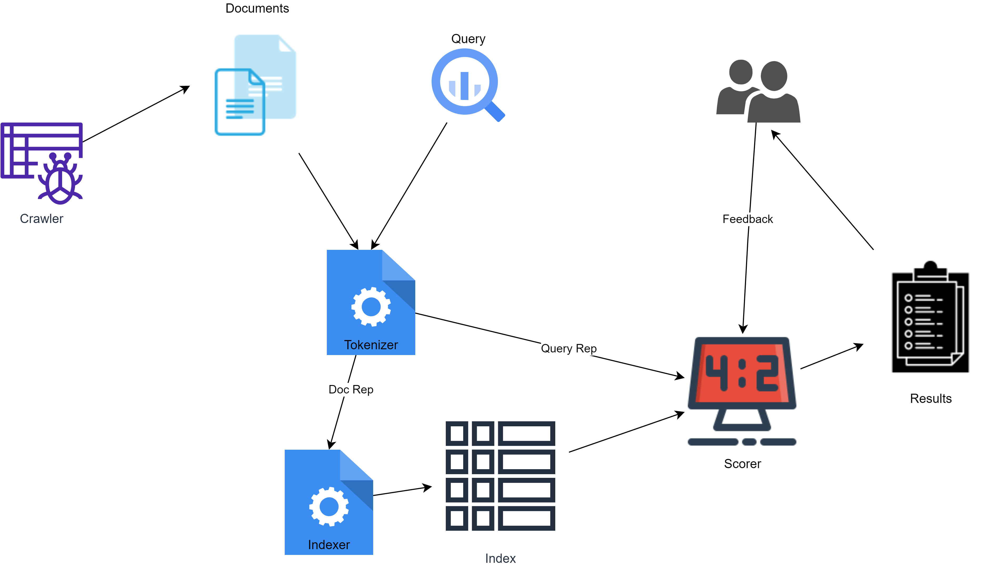
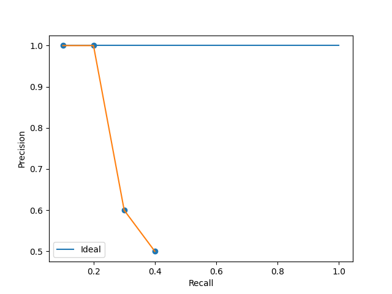

# Text Retrieval and Search Engines

## Formal Formulation of TR (Text Retrieval)
- `Vocabulary`: $V = \{w_1, w_2, ..., w_N\}$
- `Query`: $q = q_1 q_2 ... q_m, q_i \in V $
- `Document`: $d_i = d_{i1} d_{i2} ... d_{im_i}, d_{ij} \in V$
- `Collection`: $C = \{ d_1, d2, ..., d_M \}$
- `Set of relevant document`: $R(q) \subseteq C$
- `Task`: Compute $R'(q)$, an approximation of $R(q)$

## Computing R'(q)
- Document Selection
    - Absolute relevance
    - Binary classification
- Document Ranking
    - $R'(q) = \{ d \in C | f(d, q) > \theta \}$ where $f(d, q)$ is a relevance measure function and $\theta$ is a cutoff.
    - Relative relevance
    - Ranking is preferred as all relevant documentsa are not equally relevant

## Types of Ranking Functions
1. Similarity-Based
    - VSM (Vector Space Model)
2. Probabilistic
    - Language Model
    - Divergence-from-Randomness Model
3. Probabilistic Inference
4. Axiomatic Model

## Important Notations
- `Term Frequency (TF)`, denoted by $c(w, d)$ is a frequency count of word - $w$ in document - $d$
- `Document length` is denoted by $|d|$
- `Document Frequency (DF)`, denoted by $df(w)$ is a count of documents where the word - $w$ is present
> **Note**  
> These metrics are `measured after` the `initial preprocessing` of the document/web-page such as `stemming`, `removal of stopwords` etc.

## VSM
It uses vector representation of the `query` and `doc` to determine their similarity. It assumes that $f(q, d) \propto similarity(q, d)$. The vectors are represented in an `N-dimensional space` similar to the size of the `vocabulary`.

- `Query`: $q = (x_1, x_2, ..., x_N)$ where $x_i \in \mathbb{R}$ is `query term weight`
- `Doc`: $d = (y_1, y_2, ..., y_N)$ where $y_i \in \mathbb{R}$ is `doc term weight`

### Simplest Instantiation
- Bit Vector
    - $x_i, y_i \in \{ 0, 1 \}$
        - `1`: word $w_i$ is present
        - `0`: word $w_i$ is absent
- Dot Product
    - $f(q, d) = q.d = \sum_{i=1}^{N}{x_iy_i}$
    - $f(q, d)$ is basically equal to the number of `distinct` query words matched in d.  MN

### Improvements
- $x_i, y_i = c(w_i, q/d)$
- `Inverse Document Frequency (IDF)`
    - $IDF(w) = log\frac{M+1}{k}$ where $M$ is the total number of docs in the collection and $k = df(w)$
    - $y_i = c(w_i, d) * IDF(w_i)$
    - The idea is to penalize frequently occuring terms such as `the`, `a`, `about` which do not convey any special meaning about the document
- Where are we?
$$f(q, d) = \sum_{i=1}^{N}{x_iy_i} = \sum_{w \in q \cap d}{c(w, q)c(w, d)log{\frac{M+1}{df(w)}}}$$
- `TF Transformation`: `BM25`
    - The idea is to set an asymptotic upper limit on `Term Frequency`
    - $y=\frac{(k+1)x}{x + k}$ where $k$ is a constant and $x = c(w, d)$
    - $k = 0$ represents the special case of `Bit Vectors`
    - With a very large $k$, the function simulates $y=c(w,d)$
- `Document Length Normalization`
    - The idea is to penalize long documents as they have a chance to match any query
    - `Pivoted Length Normalization VSM [Singhal et al 96]`
        $$f(q, d) = \sum_{w \in q \cap d}{c(w, q)\frac{ln(1+ln(1+c(w,d)))}{1-b+b\frac{|d|}{avdl}}log{\frac{M+1}{df(w)}}}$$
        $$b \in [0, 1]$$
    - `BM25/Okapi [Robertson & Walker 94]`
        $$f(q, d) = \sum_{w \in q \cap d}{c(w, q)\frac{(k + 1)c(w, d)}{c(w, d) + k(1-b+b\frac{|d|}{avdl})}log{\frac{M+1}{df(w)}}}$$
        $$k \in [0, \infty)$$

### Further Improvements
- BM25F
- BM25+

## System Architecture

### Tokenization
- Transform everything to lowercase
- Remove stopwords
- `Stemming`: Mapping similar words to the same root form such as `computer, computation, computing` should map be `compute`

### Indexing
- Converting documents to data structures that enable fast search
- Inverted index is the dominating method

#### Data Structures
1. `Dictionary`
    - Modest size
    - In-memory
2. `Postings`
    - Huge
    - Secondary memory
    - Compression is desirable

## Zipf's Law
$$Rank * Frequency \approx Constant$$

$$F(w) = \frac{C}{r(w)^\alpha}$$

$$\alpha \approx 1, C \approx 0.1$$

This tells us that words with lower ranks having huge postings may be dropped all together as they do not meaningfully contribute to the ranking.

## Evaluation

### Metrics
1. Effectiveness/Accuracy
2. Efficiency
3. Usability

### Precision v. Recall

|            | Retrieved | Not Retrieved |
|------------|-----------|---------------|
| Relavant   | a         | b             |
| Irrelevant | c         | d             |

$$Precision = \frac{a}{a + c}$$

$$Recall = \frac{a}{a + b}$$

Ideally, $Precision = Recall = 1.0$. In reality, high recall tends to be associated with low precision.

#### F-Measure

$$F_\beta = \frac{(\beta^2 + 1)PR}{\beta^2P + R}$$

$$F_1 = \frac{2PR}{R + R}$$

#### Precision-Recall (PR) Curve

|      | P   | R    |
|------|-----|------|
| D1+  | 1/1 | 1/10 |
| D2+  | 2/2 | 2/10 |
| D3-  |     |      |
| D4-  |     |      |
| D5+  | 3/5 | 3/10 |
| D6-  |     |      |
| D7-  |     |      |
| D8+  | 4/8 | 4/10 |
| D9-  |     |      |
| D10- |     |      |

The table above represents the P-R measures for a TR system's ranked list for a query. Notice that only entries with a relevant documents are considered for the PR Curve. The relevant documents have been identified by a `+` in the table as opposed to a `-` for irrelevant ones. For the rest of the entries in the list which goes on, `precision may be assumed to be 0`.

*Fig. PR Curve*

#### Average Precision
$$Average Precision = \frac{\frac{1}{1} + \frac{2}{2} + \frac{3}{5} + \frac{4}{8} + 0 + 0 + 0 + 0 + 0 + 0}{10}$$

#### MAP
Arithmetic mean of average precision over a set of queries.

#### gMAP
Geometric mean of average precision over a set of queries.

### Multi-level Relevance Judgements

|    | Gain | Cumulative Gain | Discounted Cumulative Gain |
|----|------|-----------------|----------------------------|
| D1 | 3    | 3               | 3                          |
| D2 | 2    | 3+2             | 3+2/log2                   |
| D3 | 1    | 3+2+1           | 3+2/log2+1/log3            |
| D4 | 1    | 3+2+1+1         | 3+2/log2+1/log3+1/log4     |

#### Normalized DCG
$$nDCG_k = \frac{DCG_k}{Ideal DCG_k}$$

Assuming, there are 9 documents rated `3` in the collection pointed to by the table above,
$$IdealDCG_{10} = 3 + \frac{3}{log{2}} + ... + \frac{3}{log{9}} + \frac{2}{log{10}}$$

### Statistical Significance Testing

| Query   | Sys A | Sys B | Sign Test | Wilcoxon |
|---------|-------|-------|-----------|----------|
| 1       | 0.02  | 0.76  | +         | +0.74    |
| 2       | 0.39  | 0.07  | -         | -0.32    |
| 3       | 0.16  | 0.37  | +         | +0.21    |
| Average | 0.19  | 0.4   | p=1.0     | p=0.63   |

### Pooling: Avoid Judging all Documents for Evaluation
We cannot afford judging all documents, so can combine the `top-k` documents returned by different strategies and only judge them. The rest can be given a default relevance value.
